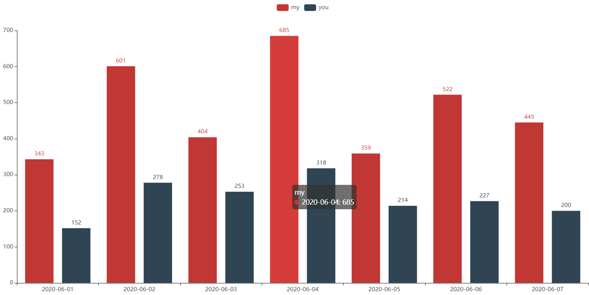
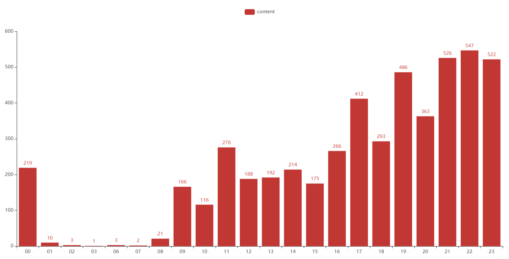
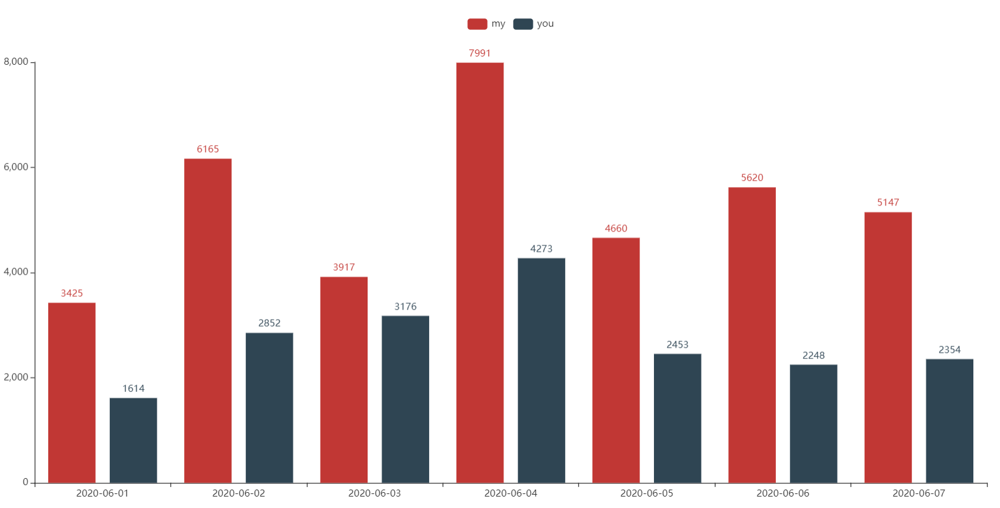

## wechat_analysis

#### 原理

使用工具解密微信数据库，通过对解密后的 db 文件进行分析从而得出 HTML 图表。

微信数据库解密工具地址：[https://github.com/libra146/decrypt_wechat_database](https://github.com/libra146/decrypt_wechat_database)

图表内容可添加，欢迎 PR。

#### 使用方法

需要要给 python 环境，安装依赖。

run 文件一共有两个，一个是 py 文件，一个是 jupyter notebook 文件，两个文件内容是相同的，选择适合你的文件，将文件中对应的变量填入相应内容即可使用。

```python
# 微信数据库路径
path = ''
# 需要分析的人的微信号
talker = ''
```

生成的 HTML 图表文件 (render.html) 在脚本运行目录下。

类似于：

> 以下数据随机而来

- 每个人聊天记录条数按天数分布



- 每天聊天记录条数按时间分布



- 词云


- 每天每人聊天记录字数统计



- 等等。

#### TODO

- [ ] 给图表添加标题
- [ ] 通过 docker 进行自动化分析
- [ ] 添加新的分析

